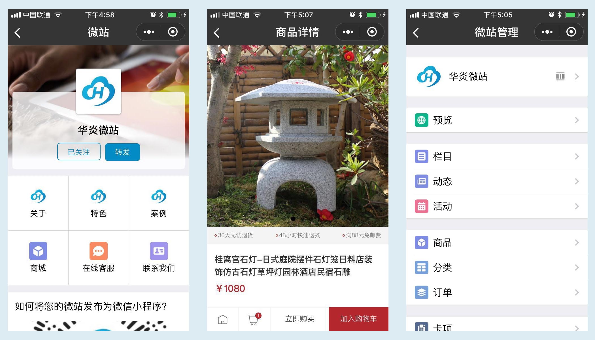

# 华炎微站、微商城小程序

华炎微站是华炎公司最新发布的的自助式微站解决方案，帮助用户0成本搭建移动互联网时代的移动信息门户和电子商务平台。

华炎微站的小程序端和服务端的源码都是完全公开的。并已经服务于多个大型项目。

### 界面效果图

### 微信扫码访问小程序

# 服务端

华炎微站服务端基于Creator快速开发平台构建。可通过以下地址访问数据模型设计。

### 商户
- [商户](https://github.com/steedos/creator/blob/master/packages/steedos-creator/models/space.coffee)
- [员工](https://github.com/steedos/creator/blob/master/packages/steedos-creator/models/space_user.coffee)
- [门店](https://github.com/steedos/creator/tree/master/packages/steedos-vip-card/models)
- [门店WIFI](https://github.com/steedos/creator/blob/master/packages/steedos-vip-card/models/vip_wifi.coffee)

### 微站
- [文章](https://github.com/steedos/creator/blob/master/packages/steedos-post/models/post.coffee)
- [栏目](https://github.com/steedos/creator/blob/master/packages/steedos-post/models/post_category.coffee)
- [评论](https://github.com/steedos/creator/blob/master/packages/steedos-post/models/post_comments.coffee)
- [主菜单](https://github.com/steedos/creator/blob/master/packages/steedos-vip-card/models/vip_menu.coffee)

### 微商城
- [商品](https://github.com/steedos/creator/blob/master/packages/steedos-vip-card/models/vip_product.coffee)
- [分类](https://github.com/steedos/creator/blob/master/packages/steedos-vip-card/models/vip_product_category.coffee)
- [订单](https://github.com/steedos/creator/blob/master/packages/steedos-vip-card/models/vip_order.coffee)
- [会员卡](https://github.com/steedos/creator/blob/master/packages/steedos-vip-card/models/vip_card.coffee)

### API 接口
对于以上定义的数据模型，Creator自动生成基于国际标准[ODATA](http://www.odata.org/)协议的API接口。华炎微站小程序基于ODATA接口查询Creator中的业务数据并执行增删改操作。
- [身份验证](https://github.com/steedos/help/blob/master/zh-cn/creator/odata_auth.md): 访问ODATA接口必须提供用户身份信息，用户只能在权限范围内进行数据查询和修改
- [获取数据字典](https://github.com/steedos/help/blob/master/zh-cn/creator/odata_metadata.md)：通过接口获取业务数据的数据结构
- [业务数据查询](https://github.com/steedos/help/blob/master/zh-cn/creator/odata_query.md): 通过接口查询业务数据，可执行多字段组合查询
- [业务数据新增](https://github.com/steedos/help/blob/master/zh-cn/creator/odata_add.md)：通过接口新增一条业务数据记录
- [业务数据编辑](https://github.com/steedos/help/blob/master/zh-cn/creator/odata_edit.md)：通过接口编辑更新指定一条业务数据记录
- [业务数据删除](https://github.com/steedos/help/blob/master/zh-cn/creator/odata_delete.md)：通过接口删除指定的一条业务数据记录

### 关于Creator
Creator智能开发平台从业务蓝图、界面元素、数据关系三个维度，对用户需求进行建模，再根据设计好的业务模型自动生成手机、电脑、平板三合一管理信息管理系统。
- 项目源码：https://github.com/steedos/creator/
- 使用说明：https://www.steedos.com/cn/help/creator/

